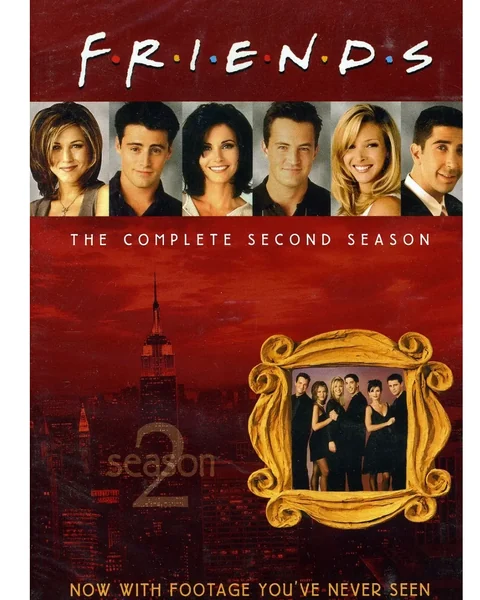
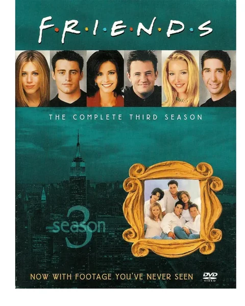
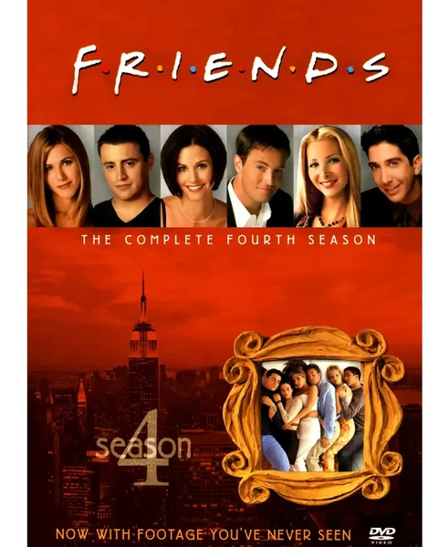

<p align="center">
  <a href="https://github.com/andylee1890/reciter-resources">
    
  </a>
</p>

<h1 align="center">复读机英语学习资源库</h1>

<p align="center">
  <strong>Reciter Resources · 可直接引用的英语学习资源</strong>
</p>

<p align="center">
  <a href="https://englishanchor.online"><strong>EnglishAnchor 官网</strong></a>
  <br/>
  <a href="https://t.me/+zUqHQVAF42xlODgx"><strong>Telegram 交流群</strong></a>
</p>

---

这个仓库保存复读、跟读、字幕对齐等学习场景可直接引用的公开文本资源。

[**资源索引**](https://github.com/andylee1890/reciter-resources/tree/main/release-records) · [**课程与封面主索引**](https://raw.githubusercontent.com/andylee1890/reciter-resources/main/release-records/index.json)

## 资源目录

<!-- RESOURCE_CATALOG_START -->
资源海报、介绍、更新日期、版本和下载入口会保持同步。

| 卡组 | 介绍 | 更新日期 | 版本 | 下载链接 |
| :---: | --- | :---: | :---: | :---: |
| <div align="center"><br/><strong>American Accent Training 4e</strong></div> | 459 条音频；可用 SRT / 中译 SRT / RECX 文本。 | 2026-08-16 | `v1` | [GitHub Releases (7 parts)](https://github.com/andylee1890/reciter-resources/releases/tag/american-accent-training-4e-audio-part-01-v1) |
| <div align="center"><br/><strong>Friends Season 01</strong></div> | 24 条音频；可用 SRT / REC / RECX 文本。 | 2026-08-04 | `v1` | [GitHub Release](https://github.com/andylee1890/reciter-resources/releases/tag/friends-s01-audio-v1) |
| <div align="center"><br/><strong>Friends Season 02</strong></div> | 24 条音频；可用 SRT / RECX 文本。 | 2026-08-04 | `v1` | [GitHub Release](https://github.com/andylee1890/reciter-resources/releases/tag/friends-s02-audio-v1) |
| <div align="center"><br/><strong>Friends Season 03</strong></div> | 25 条音频；可用 SRT / REC / RECX 文本。 | 2026-08-04 | `v1` | [GitHub Release](https://github.com/andylee1890/reciter-resources/releases/tag/friends-s03-audio-v1) |
| <div align="center"><br/><strong>Friends Season 04</strong></div> | 24 条音频；可用 SRT / RECX 文本。 | 2026-08-04 | `v1` | [GitHub Release](https://github.com/andylee1890/reciter-resources/releases/tag/friends-s04-audio-v1) |
| <div align="center"><br/><strong>Friends Season 05</strong></div> | 24 条音频；可用 SRT / REC / RECX 文本。 | 2026-08-04 | `v1` | [GitHub Release](https://github.com/andylee1890/reciter-resources/releases/tag/friends-s05-audio-v1) |
| <div align="center"><br/><strong>Friends Season 06</strong></div> | 25 条音频；可用 SRT / REC / RECX 文本。 | 2026-08-04 | `v1` | [GitHub Release](https://github.com/andylee1890/reciter-resources/releases/tag/friends-s06-audio-v1) |
| <div align="center"><br/><strong>Friends Season 07</strong></div> | 24 条音频；可用 SRT / REC / RECX 文本。 | 2026-08-04 | `v1` | [GitHub Release](https://github.com/andylee1890/reciter-resources/releases/tag/friends-s07-audio-v1) |
| <div align="center"><br/><strong>Friends Season 08</strong></div> | 24 条音频；可用 SRT / REC / RECX 文本。 | 2026-08-04 | `v1` | [GitHub Release](https://github.com/andylee1890/reciter-resources/releases/tag/friends-s08-audio-v1) |
| <div align="center"><br/><strong>Friends Season 09</strong></div> | 23 条音频；可用 SRT / REC / RECX 文本。 | 2026-08-04 | `v1` | [GitHub Release](https://github.com/andylee1890/reciter-resources/releases/tag/friends-s09-audio-v1) |
| <div align="center"><br/><strong>Friends Season 10</strong></div> | 16 条音频；可用 SRT / RECX 文本。 | 2026-08-04 | `v1` | [GitHub Release](https://github.com/andylee1890/reciter-resources/releases/tag/friends-s10-audio-v1) |
| <div align="center"><br/><strong>New Concept English Book 1 American</strong></div> | 72 条音频；可用 LRC / RECX 文本。 | 2026-08-03 | `v1` | [GitHub Release](https://github.com/andylee1890/reciter-resources/releases/tag/new-concept-english-1-us-audio-v1) |
| <div align="center"><br/><strong>New Concept English Book 2 American</strong></div> | 96 条音频；可用 LRC / REC 文本。 | 2026-08-03 | `v1` | [GitHub Release](https://github.com/andylee1890/reciter-resources/releases/tag/new-concept-english-2-us-audio-v1) |
| <div align="center"><br/><strong>New Concept English Book 3 American</strong></div> | 60 条音频；可用 LRC / REC / RECX 文本。 | 2026-08-03 | `v1` | [GitHub Release](https://github.com/andylee1890/reciter-resources/releases/tag/new-concept-english-3-us-audio-v1) |
| <div align="center"><br/><strong>New Concept English Book 4 American</strong></div> | 48 条音频；可用 LRC / REC / RECX 文本。 | 2026-08-03 | `v1` | [GitHub Release](https://github.com/andylee1890/reciter-resources/releases/tag/new-concept-english-4-us-audio-v1) |
| <div align="center"><br/><strong>The Big Bang Theory Season 01</strong></div> | 17 条音频；可用 SRT / REC 文本。 | 2026-08-04 | `v1` | [GitHub Release](https://github.com/andylee1890/reciter-resources/releases/tag/the-big-bang-theory-s01-audio-v1) |
| <div align="center"><br/><strong>The Big Bang Theory Season 02</strong></div> | 23 条音频；可用 SRT / REC 文本。 | 2026-08-04 | `v1` | [GitHub Release](https://github.com/andylee1890/reciter-resources/releases/tag/the-big-bang-theory-s02-audio-v1) |
| <div align="center"><br/><strong>The Big Bang Theory Season 03</strong></div> | 23 条音频；可用 SRT / REC 文本。 | 2026-08-04 | `v1` | [GitHub Release](https://github.com/andylee1890/reciter-resources/releases/tag/the-big-bang-theory-s03-audio-v1) |
| <div align="center"><br/><strong>The Big Bang Theory Season 04</strong></div> | 24 条音频；可用 SRT / REC 文本。 | 2026-08-04 | `v1` | [GitHub Release](https://github.com/andylee1890/reciter-resources/releases/tag/the-big-bang-theory-s04-audio-v1) |
| <div align="center"><br/><strong>The Big Bang Theory Season 05</strong></div> | 24 条音频；可用 SRT / REC 文本。 | 2026-08-04 | `v1` | [GitHub Release](https://github.com/andylee1890/reciter-resources/releases/tag/the-big-bang-theory-s05-audio-v1) |
| <div align="center"><br/><strong>The Big Bang Theory Season 06</strong></div> | 24 条音频；可用 SRT / REC 文本。 | 2026-08-04 | `v1` | [GitHub Release](https://github.com/andylee1890/reciter-resources/releases/tag/the-big-bang-theory-s06-audio-v1) |
| <div align="center"><br/><strong>The Big Bang Theory Season 07</strong></div> | 24 条音频；可用 SRT / REC 文本。 | 2026-08-04 | `v1` | [GitHub Release](https://github.com/andylee1890/reciter-resources/releases/tag/the-big-bang-theory-s07-audio-v1) |
| <div align="center"><br/><strong>The Big Bang Theory Season 08</strong></div> | 24 条音频；可用 SRT / REC 文本。 | 2026-08-04 | `v1` | [GitHub Release](https://github.com/andylee1890/reciter-resources/releases/tag/the-big-bang-theory-s08-audio-v1) |
| <div align="center"><br/><strong>The Big Bang Theory Season 09</strong></div> | 24 条音频；可用 SRT / REC 文本。 | 2026-08-04 | `v1` | [GitHub Release](https://github.com/andylee1890/reciter-resources/releases/tag/the-big-bang-theory-s09-audio-v1) |
| <div align="center"><br/><strong>The Big Bang Theory Season 10</strong></div> | 24 条音频；可用 SRT / REC 文本。 | 2026-08-04 | `v1` | [GitHub Release](https://github.com/andylee1890/reciter-resources/releases/tag/the-big-bang-theory-s10-audio-v1) |
| <div align="center"><br/><strong>The Big Bang Theory Season 11</strong></div> | 24 条音频；可用 SRT / REC 文本。 | 2026-08-04 | `v1` | [GitHub Release](https://github.com/andylee1890/reciter-resources/releases/tag/the-big-bang-theory-s11-audio-v1) |
| <div align="center"><br/><strong>The Office US Season 01</strong></div> | 6 条音频；可用 SRT / RECX 文本。 | 2026-08-03 | `v1` | [GitHub Release](https://github.com/andylee1890/reciter-resources/releases/tag/the-office-us-s01-audio-v1) |
| <div align="center"><br/><strong>The Office US Season 02</strong></div> | 22 条音频；可用 SRT / REC / RECX 文本。 | 2026-08-03 | `v1` | [GitHub Release](https://github.com/andylee1890/reciter-resources/releases/tag/the-office-us-s02-audio-v1) |
| <div align="center"><br/><strong>The Office US Season 03</strong></div> | 22 条音频；可用 SRT / RECX 文本。 | 2026-08-03 | `v1` | [GitHub Release](https://github.com/andylee1890/reciter-resources/releases/tag/the-office-us-s03-audio-v1) |
| <div align="center"><br/><strong>The Office US Season 04</strong></div> | 14 条音频；可用 SRT / RECX 文本。 | 2026-08-03 | `v1` | [GitHub Release](https://github.com/andylee1890/reciter-resources/releases/tag/the-office-us-s04-audio-v1) |
| <div align="center"><br/><strong>The Office US Season 05</strong></div> | 26 条音频；可用 SRT / REC / RECX 文本。 | 2026-08-04 | `v1` | [GitHub Release](https://github.com/andylee1890/reciter-resources/releases/tag/the-office-us-s05-audio-v1) |
| <div align="center"><br/><strong>The Office US Season 06</strong></div> | 25 条音频；可用 SRT / RECX 文本。 | 2026-08-04 | `v1` | [GitHub Release](https://github.com/andylee1890/reciter-resources/releases/tag/the-office-us-s06-audio-v1) |
| <div align="center"><br/><strong>The Office US Season 07</strong></div> | 24 条音频；可用 SRT / RECX 文本。 | 2026-08-04 | `v1` | [GitHub Release](https://github.com/andylee1890/reciter-resources/releases/tag/the-office-us-s07-audio-v1) |
| <div align="center"><br/><strong>The Office US Season 08</strong></div> | 24 条音频；可用 SRT / REC / RECX 文本。 | 2026-08-04 | `v1` | [GitHub Release](https://github.com/andylee1890/reciter-resources/releases/tag/the-office-us-s08-audio-v1) |
| <div align="center"><br/><strong>The Office US Season 09</strong></div> | 23 条音频；可用 SRT / RECX 文本。 | 2026-08-04 | `v1` | [GitHub Release](https://github.com/andylee1890/reciter-resources/releases/tag/the-office-us-s09-audio-v1) |
| <div align="center"><br/><strong>Yes Minister</strong></div> | 22 条音频；可用 SRT / REC 文本。 | 2026-08-04 | `v1` | [GitHub Release](https://github.com/andylee1890/reciter-resources/releases/tag/yes-minister-audio-v1) |
| <div align="center"><br/><strong>Yes Prime Minister</strong></div> | 16 条音频；可用 SRT / LRC / REC 文本。 | 2026-08-04 | `v1` | [GitHub Release](https://github.com/andylee1890/reciter-resources/releases/tag/yes-prime-minister-audio-v1) |
<!-- RESOURCE_CATALOG_END -->

## 如何引用

文本资源位于 `resources/`，可以通过 GitHub Raw 或 jsDelivr 引用。

GitHub Raw:

`https://raw.githubusercontent.com/andylee1890/reciter-resources/main/resources/...`

jsDelivr:

`https://cdn.jsdelivr.net/gh/andylee1890/reciter-resources@main/resources/...`

音频资源不提交到 Git 历史，按资料包或季发布到 GitHub Releases 或 Internet Archive。部分资料包仅由 Internet Archive 提供独立文件直链。每次发布的可用链接记录在 [release-records](https://github.com/andylee1890/reciter-resources/tree/main/release-records)。

## 机器可读索引

已发布的资料包、音频下载地址、配套文本链接和课程封面均汇总在同一个 JSON 主索引中；未实际发布的 dry run 记录不会进入索引。

- GitHub Raw：`https://raw.githubusercontent.com/andylee1890/reciter-resources/main/release-records/index.json`
- jsDelivr：`https://cdn.jsdelivr.net/gh/andylee1890/reciter-resources@main/release-records/index.json`
- 独立海报索引（兼容入口）：`https://raw.githubusercontent.com/andylee1890/reciter-resources/main/artwork/posters/index.json`

## 资源边界

- `.srt`、`.lrc`、`.rec`、`.recx` 属于可版本化的文本资产，直接提交到 Git。
- `.mp3` 等音频文件不进入 Git 历史，按每一季或每个资料包上传到 GitHub Releases 或 Internet Archive；索引只列出实际验证过的单文件直链。
- 音频与文本文件保持同一个 basename，方便前端自动配对，例如：

```text
The Office US S02E01 The Dundies.mp3
The Office US S02E01 The Dundies.srt
The Office US S02E01 The Dundies.rec
```

## 目录

- [resources](https://github.com/andylee1890/reciter-resources/tree/main/resources)：字幕、LRC、REC、RECX 等文本资源。
- [release-records](https://github.com/andylee1890/reciter-resources/tree/main/release-records)：音频发布、链接索引和撤回记录。

## 使用说明

本仓库面向非盈利学习用途整理资源，不声称官方授权、正版合作或替代原始发行渠道。

如果明确权利方要求撤下某项资源，会按资源粒度处理对应文件或 Release，并在发布记录中留下处理说明。
